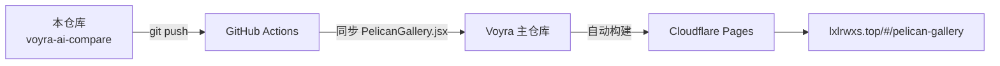

<div align="center">

# 🎨 Voyra · AI 模型对比秀 · AI Model Comparison Showcase

**同一道题交给 16 个 AI 模型，一页看完所有答案 ｜ One prompt, 16 AI models, side-by-side on one page**

[](https://github.com/liixnglinb/voyra-ai-compare/actions/workflows/sync-to-voyra.yml)


### [🌐 在线演示 Live Demo](https://lxlrwxs.top/#/pelican-gallery) ｜ [🏠 Voyra 主站 Main Site](https://lxlrwxs.top) ｜ [📦 主仓库 Main Repo](https://github.com/liixnglinb/Voyra)

</div>

---

## 💡 这是什么 / What Is This

同一个题目——**「鹈鹕骑自行车」SVG 2D 动画**——分别交给 16 个主流 AI 大模型生成，所有作品在同一页按生成时间排列，直观对比各家模型的代码能力、动画审美与细节处理。

*One single prompt — a pelican riding a bicycle as an animated SVG — was given to 16 mainstream LLMs. Every output is collected on one page and ordered by generation time, so you can compare coding ability, motion design and attention to detail across models at a glance.*

## ✨ 功能特性 / Features

- **16 模型同题对比**：每份作品独立沙盒渲染，互不干扰。
  *16 models on one prompt; each result renders in an isolated sandboxed iframe.*
- **纯 SVG 动画**：无需图片/视频资源，矢量动画任意缩放不失真。
  *Pure vector SVG animation — crisp at any resolution, no media assets.*
- **排序偏好记忆**：按生成时间/点赞数排序，选择自动记住。
  *Sort by newest or by likes; the preference is remembered.*
- **累计点赞**：点赞数由云端数据服务持久化，全站累计。
  *Persistent like counts backed by a cloud data service.*
- **懒加载淡入**：iframe 进入视口才加载，加载完成平滑淡入，性能友好。
  *Lazy iframes fade in on scroll for smooth performance.*

## 🛠 技术栈 / Tech Stack

| 类别 Category | 技术 Stack |
| --- | --- |
| 框架 Framework | React 18（Hooks） |
| 构建 Build | Vite 5 |
| 样式 Styling | Tailwind CSS |
| 渲染 Rendering | 沙盒 iframe + 内联 SVG 动画 |
| 云端数据 Data | Bmob（hydrogen-js-sdk，Voyra 共享层） |
| 图标 Icons | lucide-react |

## 📁 目录结构 / Structure

```
src/
└── pages/
    └── PelicanGallery.jsx   # 对比秀主页面：模型列表/沙盒渲染/排序/点赞
                             # Main page: list, sandbox render, sort, likes
```

## 🔗 与 Voyra 主仓库的关系 / How It Syncs

本仓库是 Voyra 个人工具中心「AI 模型对比秀」模块的**独立源码仓库**：代码在本仓库维护，每次 `push` 由 GitHub Actions 自动同步到 Voyra 主仓库的相同路径，主仓库统一构建并部署到 Cloudflare Pages。

*Standalone source repo of the AI Model Showcase module. Every push is auto-synced into the main Voyra repository, which builds and deploys the whole site.*



## 🚀 本地开发 / Development

模块依赖主仓库共享层（路由、鉴权、Bmob、通用组件），完整运行请克隆主仓库：

*Depends on the main repo's shared layer. Clone the main repo to run locally:*

```bash
git clone https://github.com/liixnglinb/Voyra.git
cd Voyra && npm install && npm run dev
```

## 📄 许可证 / License

MIT © [liixnglinb](https://github.com/liixnglinb)

## 🔍 关键词 / Keywords

AI模型对比 大模型对比 SVG动画 AI生成 模型能力对比 ChatGPT Claude Gemini ｜ ai model comparison llm showcase svg animation generated-by-ai react vite
